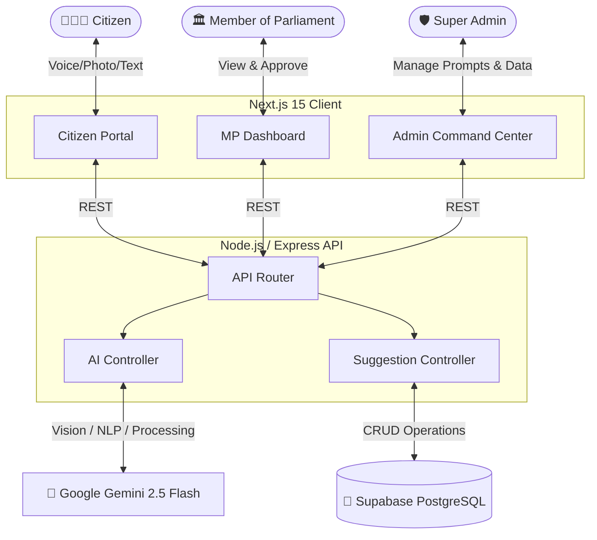
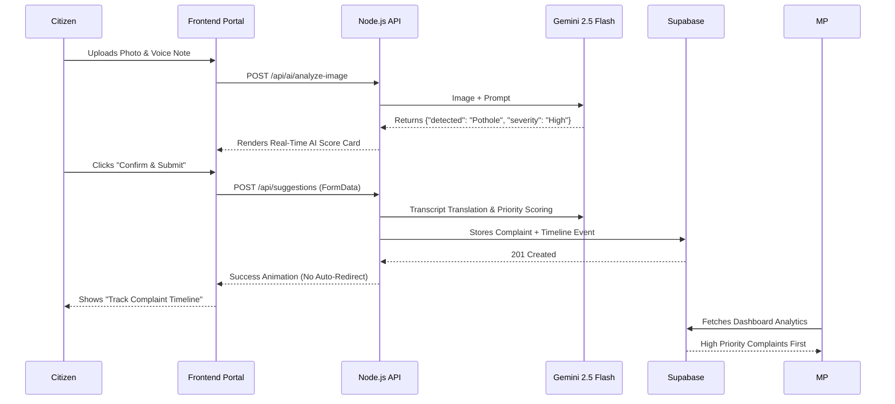

<div align="center">
  
  <h1>🇮🇳 Jansunwai AI (जनसुनवाई)</h1>
  <p><strong>AI-Powered Constituency Decision Intelligence Platform for Modern India</strong></p>
  
  [](https://nextjs.org/)
  [](https://nodejs.org/)
  [](https://deepmind.google/technologies/gemini/)
  [](https://supabase.com/)
  [](https://tailwindcss.com/)
</div>

<br/>

## 🌟 The Vision

Traditional public grievance filing is often broken—plagued by duplicate complaints, lack of structural context, and delayed responses. Members of Parliament (MPs) struggle to parse thousands of physical letters and unstructured digital complaints, making data-driven budget allocation almost impossible.

**Jansunwai AI** is a complete paradigm shift. It transforms static complaint filing into an interactive, **Data-Driven Constituency Decision Intelligence Platform**. By aggregating citizen suggestions and applying advanced **Artificial Intelligence**, it filters noise, verifies physical realities via Image Analysis, and empowers MPs to simulate and execute the most impactful infrastructural developments.

---

## 🧠 Core AI Innovations

Jansunwai AI isn't just a dashboard; it's an intelligent agent embedded within governance.

* 👁️ **Gemini Vision (Real-Time Image Analyzer):** Citizens upload photos of damaged roads, broken pipes, or unbuilt schools. The AI instantly analyzes the image in real-time, detecting the exact issue, estimating severity, and generating a confidence score—preventing fraudulent submissions.
* 🎙️ **Multilingual Voice-to-Text & Co-Author:** Illiterate or non-tech-savvy citizens can record audio in their native language. The AI transcribes the audio and instantly translates and structures it into a highly professional, formalized English proposal.
* 🔍 **Semantic Duplicate Detection:** Before a complaint is logged, the AI scans historical records to find semantically similar complaints, merging them into a single "high-impact" petition to prevent database clutter.
* 📈 **Priority Engine & Scoring:** AI grades every incoming complaint on Completeness (0-100%), Urgency, and Estimated Beneficiaries, automatically pushing critical issues to the top of the MP's dashboard.

---

## 🏗️ System Architecture



---

## 👥 Deep-Dive: User Portals

### 1. 🧑‍🤝‍🧑 Citizen Engagement Portal (`/dashboard`)
Designed for extreme accessibility and empowerment.
* **Smart Submission Form:** Real-time map picker (OpenStreetMap), drag-and-drop evidence hub, and instant AI validation.
* **AI Image Analysis in Real-Time:** Upload a photo, and the AI evaluates it on the spot (Detects Issue, Severity, Estimated Scope).
* **Live Tracker & Gamification:** Citizens can track the exact timeline of their complaint (AI Audit -> Under Review -> Planned -> Completed) and earn badges for verified infrastructural reporting.

### 2. 🏛️ MP Decision Intelligence Portal (`/mp`)
A command center for elected representatives to make the best use of their budgets.
* **KPI Command Gauge:** Health indicators displaying priority categories, registered users, and active projects.
* **AI Copilot & Priority Engine:** An embedded AI assistant that summarizes thousands of complaints into actionable insights. It sorts issues by **Impact vs. Cost**.
* **Budget Allocation Simulator:** Interactive sliders allowing MPs to tune funding across categories (Health, Roads, Water) and instantly see the simulated impact on the constituency's HDI (Human Development Index).
* **PDF Governance Reporter:** One-click generation of beautifully formatted parliamentary session reports.

### 3. 🛡️ Super Admin National Command Center (`/admin`)
The overarching view of the nation's operational health.
* **Executive India Operations Map:** Dynamic vector mapping showing live API traffic and suggestion hotspots across states.
* **Live Tick Ticker:** A real-time terminal feed of suggestions being processed nationally.
* **Dynamic Prompt Configuration Suite:** Admins can edit the fundamental system prompts for the AI models on the fly—adjusting how strict the AI auditor should be without writing a single line of code.
* **Public Datasets Ingestion:** Ground the AI's logic by uploading Census data or infrastructural baselines.

---

## 🔄 Complaint AI Workflow



---

## 🛠️ Technology Stack

* **Frontend:** Next.js 15 (App Router), React 19, Tailwind CSS v4, Framer Motion (Micro-animations), Recharts (Data Viz), Lucide Icons.
* **Backend:** Node.js, Express.js, TypeScript.
* **AI & Machine Learning:** Google GenAI SDK (Gemini 2.5 Flash for Multimodal Vision & NLP).
* **Database & Storage:** Supabase (PostgreSQL), Multer (In-memory Buffer processing).
* **Geospatial:** OpenStreetMap Nominatim API (Reverse Geocoding).

---

## ⚙️ Getting Started (Local Development)

### 1. Prerequisites
Ensure you have **Node.js** (v18+) and **npm** installed.

### 2. Clone and Install Dependencies
```bash
git clone https://github.com/your-username/jansunwai-ai.git
cd jansunwai-ai
npm install
```

### 3. Environment Variables
Create a `.env` file inside the `server/` directory:
```env
PORT=5000
GEMINI_API_KEY=your_gemini_api_key
SUPABASE_URL=your_supabase_url
SUPABASE_ANON_KEY=your_supabase_anon_key
```
*(💡 Note: If Supabase credentials are not provided, the backend seamlessly falls back to a robust In-Memory Mock Database, perfect for Hackathon demos!)*

### 4. Boot up the System
Run both the Next.js frontend and Express backend concurrently:
```bash
npm run dev
```
* **Frontend Portal:** [http://localhost:3000](http://localhost:3000)
* **Backend API:** [http://localhost:5000](http://localhost:5000)

---

## 🔑 Demo Quick-Access Credentials

To experience the platform across different roles, use the built-in preset login buttons on the `/auth` page, or use the credentials below:

| Role | Email | Password | Redirects To |
| :--- | :--- | :--- | :--- |
| **Citizen** | `aarav@mail.com` | `password` | `/dashboard` |
| **MP / Official** | `mp@jansunwai.gov.in` | `password` | `/mp` |
| **Super Admin** | `admin@jansunwai.gov.in` | `password` | `/admin` |

---

## 🏆 Real-World Impact

Jansunwai AI doesn't just digitize complaints; it **optimizes governance**. By drastically reducing the noise of duplicate and invalid complaints, and by structuring raw citizen grief into actionable, AI-estimated project proposals, it allows our leaders to spend less time reading and more time **building**.

<p align="center">
  <i>Built with ❤️ for a smarter, data-driven India.</i>
</p>
