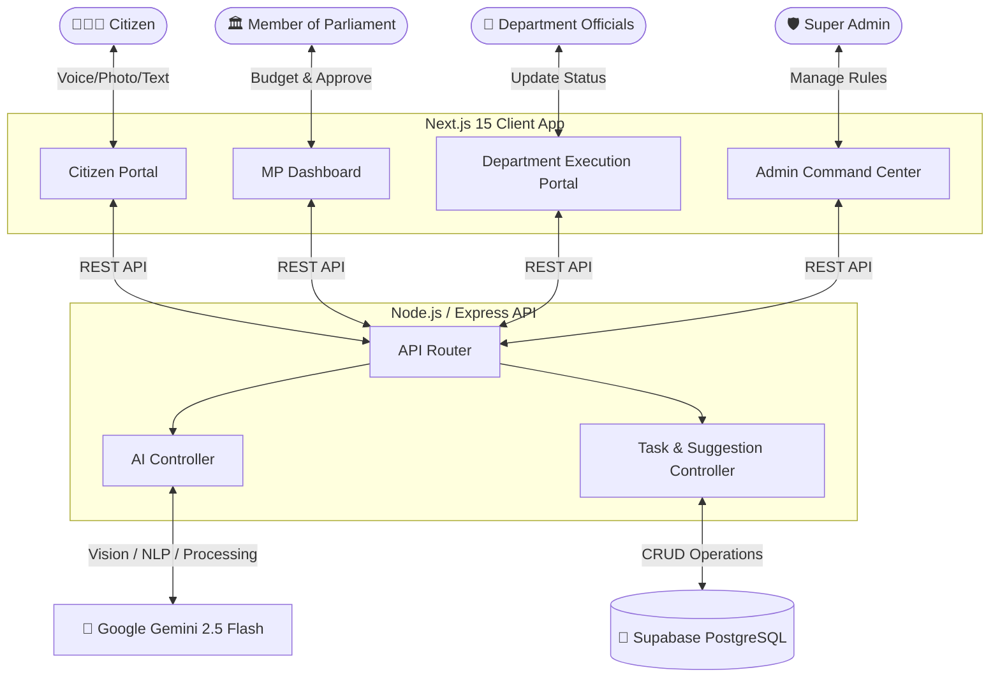
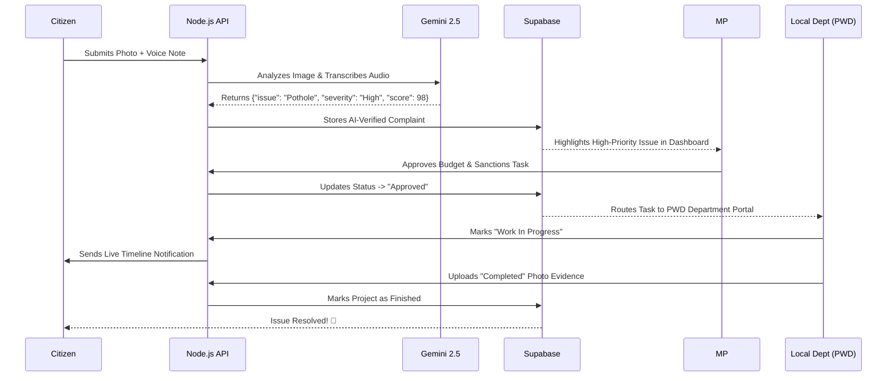

<div align="center">
  
  <h1>🇮🇳 Jansunwai AI (जनसुनवाई)</h1>
  <p><strong>AI-Powered Constituency Decision Intelligence & Execution Platform for Modern India</strong></p>
  
  [](https://nextjs.org/)
  [](https://react.dev/)
  [](https://nodejs.org/)
  [](https://www.typescriptlang.org/)
  [](https://deepmind.google/technologies/gemini/)
  [](https://supabase.com/)
  [](https://tailwindcss.com/)
</div>

<br/>

## 🌟 The Vision

Traditional public grievance filing is often broken—plagued by duplicate complaints, lack of structural context, and delayed responses. Members of Parliament (MPs) struggle to parse thousands of physical letters and unstructured digital complaints, making data-driven budget allocation almost impossible. 

**Jansunwai AI** is a complete paradigm shift. It transforms static complaint filing into an interactive, **Data-Driven Constituency Decision Intelligence & Execution Platform**. By aggregating citizen suggestions, verifying them via Artificial Intelligence, enabling MPs to simulate budget impact, and seamlessly pushing tasks to local Departments, it bridges the gap between governance and execution.

---

## 🧠 How AI is Powering Jansunwai

Jansunwai AI goes beyond a standard CRUD dashboard by integrating multi-modal AI agents directly into the governance pipeline:

* 👁️ **Gemini Vision (Real-Time Evidence Analyzer):** When citizens upload photos of a broken road or water leak, the AI instantaneously analyzes the image. It detects the precise infrastructural issue, estimates the severity level, and generates a confidence score to prevent fake or spoofed submissions.
* 🎙️ **Multilingual Voice-to-Text & Smart Structuring:** Designed for inclusivity, citizens can record complaints in their native language or raw format. The AI transcribes the audio, translates it, and synthesizes it into a formalized, highly professional English proposal ready for parliamentary review.
* 🔍 **Semantic Deduplication:** To prevent database clutter, the AI engine scans historical records for semantically similar complaints. It groups parallel local issues into unified "high-impact" petitions.
* 📈 **Priority Scoring Engine:** The AI autonomously grades every incoming complaint on Completeness (0-100%), Urgency, and Estimated Beneficiaries, automatically pushing critical issues to the top of the MP's dashboard for immediate action.

---

## 🏗️ System Architecture



---

## 👥 Deep-Dive: The Four Core Portals

### 1. 🧑‍🤝‍🧑 Citizen Engagement Portal
**The entry point for public participation.**
* **Smart Submission Hub:** Citizens submit complaints with real-time OpenStreetMap picking, drag-and-drop evidence uploads, and live AI validation.
* **Live Tracker & Gamification:** View the exact timeline of a complaint (AI Audit -> Under MP Review -> Forwarded to Dept -> Completed). Citizens earn trust scores for validated reports.

### 2. 🏛️ MP Decision Intelligence Portal
**A sophisticated command center for elected representatives.**
* **KPI Command Gauge:** Executive summary of critical issues, priority complaints, and overall constituency health.
* **AI Copilot & Priority Engine:** An embedded AI assistant that digests thousands of suggestions and sorts them by **Impact vs. Cost**.
* **Budget Allocation Simulator:** Interactive sliders allowing MPs to tune funding across categories (Health, Roads, Water) to visually simulate the projected impact on the constituency's HDI (Human Development Index).
* **Automated Sanctions:** One-click approval to instantly allocate funds and route the project directly to the relevant execution department.

### 3. 👷 Department Execution Portal *(New!)*
**The operational ground-zero for government departments (PWD, Water, Health, etc.).**
* **Department-Specific Task Queues:** Officials only see projects routed to their specific jurisdiction (e.g., PWD sees road projects, Water board sees plumbing tasks).
* **Execution & Evidence Tracking:** Departments can update project statuses in real-time (e.g., "Tender Floated", "Work in Progress", "Completed").
* **Proof of Work Uploads:** Allows ground engineers to upload completion photos, maintaining a verifiable audit trail back to the MP and the Citizen.

### 4. 🛡️ Super Admin National Command Center
**The overarching view of operational health.**
* **Executive Operations Map:** Dynamic mapping showing live API traffic and suggestion hotspots.
* **Dynamic Prompt Configuration Suite:** Admins can edit the fundamental system prompts for the AI models on the fly—adjusting strictness or language parameters without writing a single line of code.
* **Broadcast Engine:** Push critical announcements directly to citizens, MPs, or Departments simultaneously.

---

## 🔄 AI-Driven Execution Workflow



---

## 🛠️ Technology Stack

**Frontend (Client)**
* **Framework:** Next.js 15 (App Router), React 19
* **Language:** TypeScript
* **Styling:** Tailwind CSS v4, Framer Motion (for fluid micro-animations)
* **Data Visualization & Maps:** Recharts, Leaflet / OpenStreetMap

**Backend (Server)**
* **Framework:** Node.js, Express.js
* **Language:** TypeScript
* **Core Logic:** Custom routing and controller architecture

**AI & Cloud**
* **AI Engine:** Google GenAI SDK (Gemini 2.5 Flash for Multimodal Vision & NLP)
* **Database:** Supabase (PostgreSQL) 
* **Data Handling:** Multer (In-memory buffer processing for real-time edge capabilities)

---

## ⚙️ Getting Started (Local Development)

### 1. Prerequisites
Ensure you have **Node.js** (v18+) and **npm** installed.

### 2. Clone and Install Dependencies
```bash
git clone https://github.com/your-username/jansunwai-ai.git
cd jansunwai-ai
npm install
```

### 3. Environment Variables
Create a `.env.local` file inside the root directory:
```env
NEXT_PUBLIC_API_URL=http://localhost:5000
# Backend Env Variables (in server/.env)
PORT=5000
GEMINI_API_KEY=your_gemini_api_key
SUPABASE_URL=your_supabase_url
SUPABASE_ANON_KEY=your_supabase_anon_key
```
*(💡 Note: If Supabase credentials are not provided, the system gracefully falls back to a robust In-Memory Database, making it plug-and-play for hackathon demonstrations!)*

### 4. Boot up the System
Run both the Next.js frontend and Express backend concurrently:
```bash
npm run dev
```
* **Frontend Portal:** [http://localhost:3000](http://localhost:3000)
* **Backend API:** [http://localhost:5000](http://localhost:5000)

---

## 🔑 Demo Quick-Access Credentials

To experience the platform across all operational levels, you can use the preset login buttons on the `/auth` pages, or use the exact credentials below:

| Portal Role | Login URL | Email | Password |
| :--- | :--- | :--- | :--- |
| **Citizen** | `/auth/citizen` | `aarav@mail.com` | `password` |
| **MP / Official** | `/auth/mp` | `mp@jansunwai.gov.in` | `password` |
| **Department (PWD)** | `/department/login` | `pwd@jansunwai.gov.in` | `password` |
| **Super Admin** | `/auth/admin` | `admin@jansunwai.gov.in` | `password` |

---

## 🏆 Real-World Impact

Jansunwai AI doesn't just digitize complaints; it **optimizes the entire lifecycle of governance**. By drastically reducing the noise of duplicate or invalid complaints, structuring raw citizen grief into AI-estimated project proposals, and providing a seamless execution pipeline directly to local departments, it allows our leaders to spend less time reading and more time **building**.

<p align="center">
  <i>Built with ❤️ for a smarter, data-driven India.</i>
</p>
